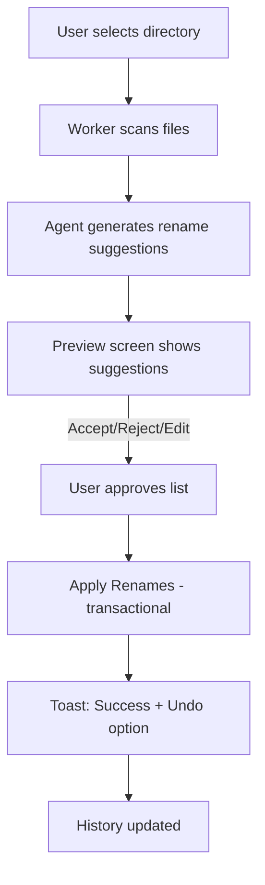
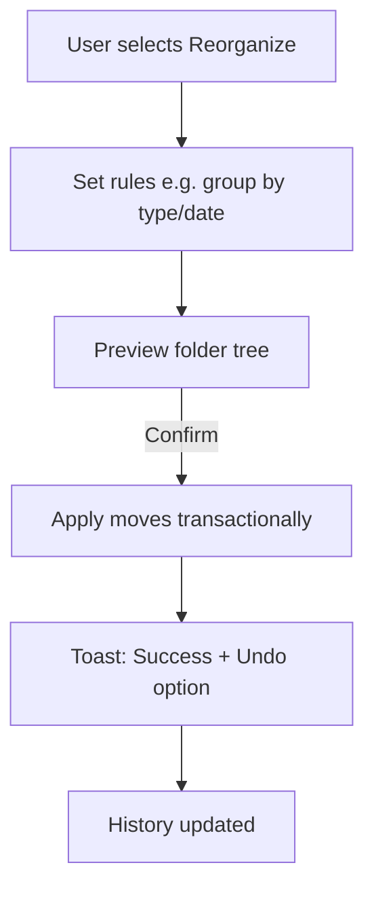
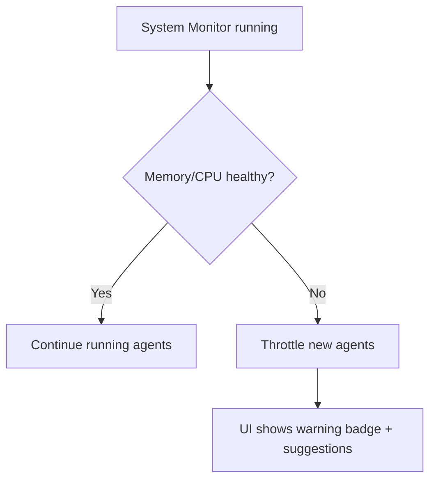

# UX Design Document
**Project**: macOS Electron App with Ollama Local Agents for File Organization  
**Author**: Iris — UX Expert  
**Date**: 2025-08-28

---

## Table of Contents
1. User Flows
2. Flow Diagrams (Mermaid)
3. Wireframes (ASCII)
4. Microcopy Guidelines
5. Accessibility Principles
6. Usability Risks & Mitigations

---

## 1. User Flows

### First-Time Setup
1. User installs app and launches for the first time.  
2. Welcome screen introduces purpose.  
3. User selects main agent, sub-agent strategy, and memory profile.  
4. Preferences stored locally (SQLite).  

### Directory Scan → Preview
1. User chooses “Scan Directory.”  
2. Files scanned by worker; progress shown.  
3. Agent suggests renames.  
4. UI displays file list with current name, suggestion, confidence, and reasoning tooltip.  

### Approve & Apply Rename
1. User reviews rename suggestions (accept/reject/edit).  
2. User applies changes → Main performs transactional renames.  
3. Undo option shown in toast notification.  

### Undo / Rollback
- Undo button replays reverse transactions, restoring original filenames.  

### Directory Reorganization
1. User sets rules (group by type/date).  
2. Preview folder tree shown.  
3. On confirm, app reorganizes structure with undo option.  

### System Health Feedback
- System monitor checks memory/CPU.  
- If resources are low → agents throttled, UI warning badge appears.  

### History & Logs
- User opens History tab.  
- Sees past scans/renames/reorg jobs.  
- Can export log or rollback selected jobs.  

---

## 2. Flow Diagrams (Mermaid)

### Flow 1 – Scan → Preview → Apply


### Flow 2 – Reorganize Directory


### Flow 3 – System Health


---

## 3. Wireframes (ASCII)

### Dashboard / Home
```
 ------------------------------------------------------
|  File Organizer AI                                    |
|-------------------------------------------------------|
| [ Scan Directory ]   [ Reorganize ]   [ History ]     |
|                                                       |
|  Recent activity:                                     |
|   ✔ Renamed 47 files in ~/Downloads                   |
|   ✔ Reorganized ~/Pictures into year/month folders    |
|                                                       |
|  System Health: [ Memory OK ] [ Agents: 2 active ]    |
 ------------------------------------------------------
```

### Scan → Preview Screen
```
 ------------------------------------------------------
|  Scanning ~/Documents ...  [ 124 / 230 files ]        |
|-------------------------------------------------------|
| Current Name          | Suggested Name     | Conf %   |
|-------------------------------------------------------|
| IMG_2345.jpg          | Beach_Sunset.jpg   | 92%      |
| report_final.docx     | Q1_Report.docx     | 87%      |
| notes.txt             | Meeting_Notes.txt  | 65% (?)  |
|-------------------------------------------------------|
| [ Accept All ]  [ Reject All ]  [ Apply Renames ]     |
 ------------------------------------------------------
```

### Reorganization Preview
```
 ------------------------------------------------------
| Reorganize ~/Downloads                                |
|-------------------------------------------------------|
| Rule: [ Group by File Type ]                          |
| Preview:                                              |
|                                                       |
|   /Downloads                                          |
|     ├── Documents                                     |
|     │    ├── report.docx                              |
|     │    └── invoice.pdf                              |
|     ├── Images                                        |
|     │    ├── beach.png                                |
|     │    └── selfie.jpg                               |
|     └── Others                                        |
|                                                       |
| [ Cancel ]                           [ Apply Changes ]|
 ------------------------------------------------------
```

### History Screen
```
 ------------------------------------------------------
| History                                               |
|-------------------------------------------------------|
| [ Date ]      [ Operation ]         [ Status ]        |
|-------------------------------------------------------|
| 2025-08-28    Rename 47 files       ✔ Success         |
| 2025-08-27    Reorganize Pictures   ✔ Success         |
| 2025-08-25    Rename 102 files      ✖ Partial (2 fail)|
|-------------------------------------------------------|
| [ Export Logs ]   [ Rollback Selected ]               |
 ------------------------------------------------------
```

---

## 4. Microcopy Guidelines

### Buttons
- Scan Directory → “Scan a folder for files”  
- Apply Renames → “Rename selected files”  
- Undo → “Revert last operation”  
- Reorganize → “Reorganize folder structure”  

### Tooltips
- Confidence % → “The AI’s confidence in this suggestion.”  
- Suggested Name → “Click to edit manually before applying.”  
- System Health badge → “App is limiting sub-agents to protect memory.”  

### Error Messages
- Rename failed → “The app doesn’t have permission to rename this file. Please grant access in System Settings.”  
- Memory overload → “System memory is low. Some agents were paused. Try lowering concurrency or choosing a smaller model.”  
- Model not found → “This model isn’t installed. Use ‘Manage Models’ to download it via Ollama.”  

### Success / Status
- After rename → “47 files renamed successfully. Undo available.”  
- After reorg → “Your folder has been reorganized. You can undo if needed.”  

---

## 5. Accessibility Principles

1. **Keyboard Navigation**  
   - All screens must be operable via keyboard.  
   - Shortcuts:  
     - ⌘O → Open Directory  
     - ⌘Z → Undo  
     - ⌘⇧H → Open History  

2. **Screen Reader Support**  
   - File rows announced as:  
     > “Current name: report_final.docx. Suggested name: Q1_Report.docx. Confidence 87%.”  

3. **Color Contrast**  
   - Contrast ratio ≥ 4.5:1.  
   - Confidence scores use icons (✔, ✖, ?) in addition to colors.  

4. **Feedback Timing**  
   - Progress updates at least every 2s.  

5. **Error Recovery**  
   - Errors always followed by an actionable option (Retry / Undo / Open Settings).  

---

## 6. Usability Risks & Mitigations

- **Risk**: Users fear auto-renaming.  
  - Mitigation: Always preview before apply, show undo prominently.  

- **Risk**: Confidence misunderstood.  
  - Mitigation: Tooltip, icons, explainable text.  

- **Risk**: Users overload agents.  
  - Mitigation: Profiles with safe defaults (Conservative/Balanced/Aggressive).  

- **Risk**: macOS permissions confuse users.  
  - Mitigation: Provide setup guide with direct link to macOS Security & Privacy.  

---

**End of UX Document**
